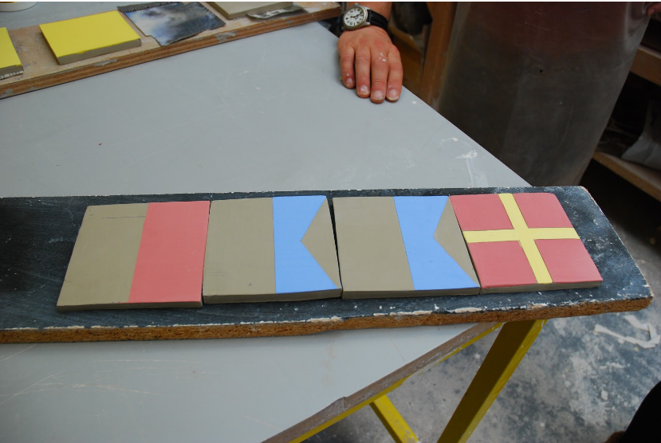

# Haar

### There is a ‘being in the know’ about the traditions and superstitions of the sea, which inspired us to create a way for a new generation of coastal teens to use ‘code’ of nautical flags to access Internet in a cave.

*By Babitha George, Jayne Wallace, Nick Taylor, Mike Shorter, Erika Shorter, Justin Marshall, Sean at the Mozilla Open IoT Design Sprint in Anstruther, June 2016*

